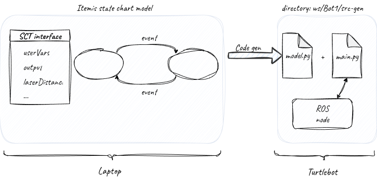
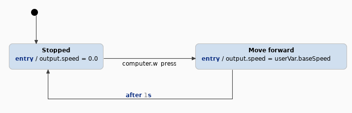

---
title: "Turtlebot workflow introduction"
...


## Turtlebot Project

For the final lab assignment, you will develop a statechart model to enable a Turtlebot to explore and map a maze. You will create this model using the ItemisCREATE statechart tool and run it on a Turtlebot3 using ROS2, the robot operating system.

Form teams of four for this assignment, dividing tasks among the group members. Suggested tasks include manual control, maze exploration algorithm, wall detection, calibration, and grid updates.

One advantage of the Turtlebot setup is its simulation environment, which allows you to test your code without needing a physical Turtlebot. It is important to test with the actual turtlebots. We have seven physical Turtlebots are available in the lab, each equipped with:

- A Raspberry Pi running Ubuntu 20.04 (the upper board).
- A Single Board Arduino Computer (SBC) managing sensors and motors (the lower board).
- A 360° LiDAR scanner which can detect objects from a distance of 16cm upto 4m away.
- An Inertial Measurement Unit (IMU) for tracking roll, pitch, and yaw.
- An odometer for tracking movement in the x and y axis.
- Stepper motors for left and right wheel motor control.

In this demo, we will examine the sensor output of a Turtlebot, create a basic statechart to control a virtual Turtlebot in the Gazebo simulator, and finally operate a real Turtlebot using the same statechart model.

## Quick Turtlebot Hardware Demo

This section demonstrates some of the Turtlebot sensor outputs. The command prompt format indicates whether the command is executed on the host laptop (`user@laptop:~$`), the Turtlebot (`ubuntu@ubuntu:~$`), or the course virtual machine (VM) (`user@vm:~$`). This section assumes that ROS2 (`foxy` or `humble`) and the Turtlebot packages are installed on the laptop. The first steps are:

1. Connect the laptop to the lab Wi-Fi network, `TP-LINK_8D52` (Wi-Fi password: `20406301`). This is a standalone access point so you will lose internet connection at this point.
2. Power On the Turtlebot by connecting its battery and using the switch on the front of SBC board (boot-up takes approximately 30 seconds).

Turtlebots in the lab have fixed IP addresses:

- Turtlebot 1: 192.168.0.101
- Turtlebot 3: 192.168.0.103
- Turtlebot 4: 192.168.0.104
- Turtlebot 5: 192.168.0.105
- Turtlebot 6: 192.168.0.106
- Turtlebot 7: 192.168.0.107
- Turtlebot 8: 192.168.0.108

To connect to a Turtlebot, use the SSH command from the laptop with `ubuntu` as the user (password: `essess`):

```shell
user@laptop:~$ ssh ubuntu@192.168.0.101
```

Each Turtlebot uses a unique ROS domain to avoid interference, controlled by the `ROS_DOMAIN_ID` environment variable. For instance, Turtlebot 1 uses ROS domain ID 1. Always make sure that you use the correct ROS domain during the lab, otherwise you will end up controlling a Turtlebot from another group! To check the domain ID on a Turtlebot, run the following command in the ssh you just opened:

```shell
ubuntu@ubuntu:~$ echo $ROS_DOMAIN_ID
1
# or alternatively:
ubuntu@ubuntu:~$ env | grep ROS
ROS_DOMAIN_ID=1
```

Launch a ROS node on the Turtlebot, this exposes sensor data and motor controls within the ROS domain:

```shell
ubuntu@ubuntu:~$ ros2 launch turtlebot3_bringup robot.launch.py
```

To display the sensor data on your laptop, set the laptop’s ROS domain to match the Turtlebot’s (e.g., `ROS_DOMAIN_ID=1`):

```shell
user@laptop:~$ export ROS_DOMAIN_ID=1
```

The sensor data and controls are exposed as ROS topics that we can access from our laptop. List the ROS topics with the command:

```shell
user@laptop:~$ ros2 topic list
```

Now let's access the real-time sensor data from these ROS topics. We can for example:

- Check battery status:

    ```shell
    user@laptop:~$ ros2 topic echo /battery_state
    ```

- View LiDAR data:

    ```shell
    user@laptop:~$ ros2 topic echo /scan
    ```

  The `scan` topic just shows the lidar data as a bunch of numbers. To visualize the laser scan and IMU sensor data we can use:

    ```shell
    user@laptop:~$ ros2 launch turtlebot3_bringup rviz2.launch.py
    ```

    The laser data is shown as coloured dots, and the IMU data is shown as three arrows for the yaw, pitch and roll of the Turtlebot.

In addition to reading sensor data we can also send commands to control the Turtlebot from our laptop. To move the robot around with keyboard commands we can start a tele-operator program with:

```shell
user@laptop:~$ ros2 run turtlebot3_teleop teleop_keyboard
```

When you are finished with the Turtlebot, press `Ctrl-C` to stop the bringup command of the ROS node. Then shutdown the Turtlebot with the command:

```shell
ubuntu@ubuntu:~$ sudo shutdown now
```

It takes approximately 30 seconds to shut down. When the LEDs stop blinking and only two LEDs remain lit on the Raspberry Pi board, turn off the Turtlebot using the power switch on the front of the SBC board. The Turtlebot is now fully shut down. **Not following this procedure can damage the Turtlebot!**

## Controlling a Turtlebot with a Statechart Model

Let's create a statechart model to control a virtual Turtlebot in the simulator. The figure below shows the workflow for creating and running statechart models on a Turtlebot:


*Figure: Workflow for controlling the Turtlebot with a statechart model*

The four steps in the workflow are:

1. **Opening the statechart project**:
   - Start the virtual machine that comes with this course. You are automatically logged in as the user `ubuntu` (password: `ubuntu`). Start itemis CREATE by clicking the green itemis CREATE icon in the dock or by executing the `itemisCREATE` command in a terminal.
   - Select the workspace `itemis_CREATE/ws`. The `Bot1` project has a the statechart file `Statechart.ysc` that is already open.
   - This project contains the SCT interface used to control the Turtlebot and read sensor data. Documentation for the interface is available in `SCT_interface_manual.pdf` on Canvas.

   If you need a fresh copy of `Bot1`, download `Bot1.zip` from Canvas (or retrieve it from the `Downloads` directory in the VM), and import it as an itemis CREATE project by navigating to **Import -> General -> 'Existing projects into workspace'** and selecting the zip archive `Bot1.zip`. Use a different workspace or delete the old `Bot1` project first to avoid duplicate projects in the same workspace.

2. **Designing a Simple Statechart Model**:
   - Create the following statechart model in itemis CREATE:

     
     *Figure: Example of a small statechart model workflow*

   - This model transitions from the `Stopped` state to the `Move forward` state when the `computer.w_press` event is triggered by pressing the "w + Enter" keys and it will return to the `Stopped` state after 1 second. The `entry` actions in the states use the `output` interface to set the speed of the Turtlebot.

3. **Generating Python Code**:
   - When you save the statechart, itemis CREATE automatically generates a Python file, `model.py`, in the `src-gen` directory. The console message `"Generating model to target project Bot1 ... model done"` confirms successful generation.
   - The `main.py` python file is the driver that will start the python statechart code in `model.py. The ROS node is used to read sensors and drive the motors of the Turtlebot.
   - If the statechart contains errors, no new Python code is generated. Errors appear as red crosses in the statechart and also under the "Problems" tab at the bottom of the screen.
    - Verify that the timestamp of `model.py` has been updated because sometimes that file is not overwritten. If this happens, delete the ``model.py`` file, modify the statechart and save it again. You can also force Python code generation by right-clicking on `Statechart.sgen` in the project explorer window and selecting `Generate Code artifacts`.
    - If the statechart editor is acting strange (e.g., you cannot delete an edge or a state), close the `Statechart.ysc` statechart file and reopen it from the project explorer on the left of the screen.


4. **Running the Model on a Virtual Turtlebot**:
   - Open two terminals in the VM with the `ROS_DOMAIN_ID` environment variable set to the same value so they can exchange ROS messages. In the VM, the `ROS_DOMAIN_ID` is set to 1 by default.
   - In the first terminal, launch the `gazebo` simulator with:

     ```shell
     user@vm:~$ ros2 launch turtlebot3_gazebo empty_world.launch.py
     ```

   - In the second terminal, navigate to the `src-gen` directory and start the statechart Python code with:

     ```shell
     user@vm:~/src-gen$ python3 main.py
     ```

   - To move the Turtlebot forward, focus keyboard input on the second terminal and press "w + Enter". Each press moves the Turtlebot forward for one second, exactly as we programmed in the statechart. Experiment by adding more movement commands to the statechart and testing them in the simulator. Now you are already implementing manual Turtlebot control, the first requirement of final project.

## Running the Statechart Model on a Physical Turtlebot

Now let's run the same generated Python statechart code on a real Turtlebot! 

1. **Transferring the Generated Code**:
   - Copy the `src-gen` directory from the VM to your host system using a shared directory or any file transfer method. Then, transfer the directory to Turtlebot1 with:

     ```shell
     user@laptop:~/shared$ scp -r src-gen ubuntu@192.168.0.101:
     ```
   - Remove old versions of the `src-gen` directory so you are sure you run the latest version of the statechart code.

2. **Setting Up Connections on the Turtlebot**:
   - Open two SSH shells to the Turtlebot from your laptop, connecting both to `ubuntu@192.168.0.101`.
   - In the first shell, start the ROS node with:

     ```shell
     ubuntu@ubuntu:~$ ros2 launch turtlebot3_bringup robot.launch.py
     ```

     Wait a couple seconds for the node to state that it is ready to serve ROS topics.

   - In the second shell, navigate to the `src-gen` directory we just copied to the Turtlebot and run the statechart Python code:

     ```shell
     ubuntu@ubuntu:~/src-gen$ python3 main.py
     ```

   - The Turtlebot is now running both the ROS node that exposes the sensor interface and our python statechart code locally. So we can move the real Turtlebot by pressing "w + Enter" in the second shell.

If you have installed ROS locally on your laptop you can also choose to run the generated Python code on the laptop.  When the laptop is connected to the same WiFi network as the Turtlebot and both devices share the same ROS_DOMAIN_ID, the Python code on the laptop can communicate with the ros node running on the Turtlebot. To run the statechart python code from your laptop run:

 ```shell
 user@laptop:~/itemisCREATE/ws/Bot1/src-gen$ python3 main.py
 ```

## Maze Exploration

To test the Turtlebot in a simulated maze with Gazebo:

1. Navigate to the maze directory on the VM with:

   ```shell
   user@vm:~$ cd maze_world_humble
   ```

2. Generate and install a new maze using:

   ```shell
   user@vm:~/maze_world_humble$ ./maze_generator.py
   user@vm:~/maze_world_humble$ cp model.sdf maze_model
   ```

3. Start the simulator in the `maze_world_humble` directory:

   ```shell
   user@vm:~/maze_world_humble$ ros2 launch maze_world.launch.py
   ```

4. Generate python code from your maze solver statechart and run it with the command:
     ```shell
     user@vm:~/ws/my_maze_solver/src-gen$ python3 main.py
     ```

5. The SCT interface records the walls as the Turtlebot explores the maze and generates the image file `map_generation.png` of the observed state of the maze in the `src-gen` directory file. You can view  with image with your favorite image viewer:

   ```shell
   user@vm:~/ws/my_maze_solver/src-gen$ sxiv map_generation.png
   ```

<!--   For physical robots, connect to the Turtlebot over SSH with graphical forwarding (`-X` flag) to display the map on your laptop:

   ```shell
   user@laptop:~$ ssh -X ubuntu@192.168.0.101
   ```
   -->

Alternatively, if you have installed ROS locally on your laptop, you can download the maze generator tar file from Canvas. If you installed ROS `humble`, download `maze_world_humble.tgz`. If you have installed ROS `foxy` use the `maze_world_foxy.tgz` instead.


### itemis CREATE License Server

itemis CREATE requires a valid license, provided by a license server. The license settings are configured in **Window -> Preferences -> itemis Licenses** . Enter `pcs-lm-01.lab.uvalight.net` as the server address, and select both licenses. You may use the "Borrow" option to work offline for up to three days.  You might need to click the ``retry`` button to get a valid license.

A license is provided based on the hostname of your machine, and only one license is permitted per unique hostname. This poses a problem for the VM provided with the course, as all VM's have the same `cps2025` hostname. To reliably obtain a license for itemis CREATE in your VM, you need to change the hostname of your VM. Use the following command to permanently change the hostname of your VM:

 ```shell
 user@vm:~$ hostnamectl hostname MyUniqueNewHostName
 ```

You can also install itemis CREATE directly on your laptop for improved performance. You can find the download link in the TurtleBot section on Canvas.
